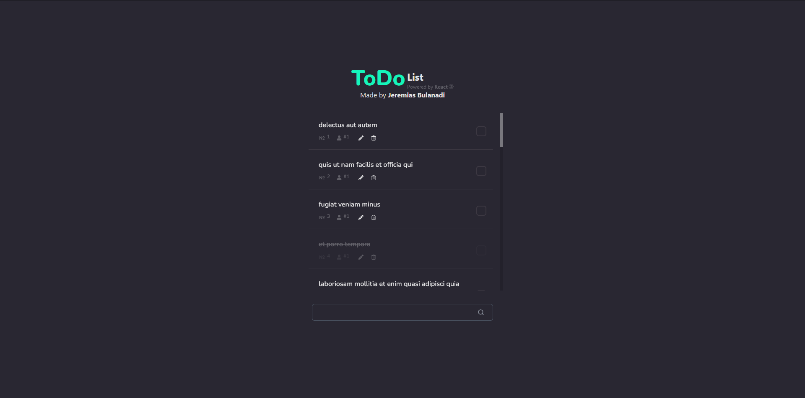

# React - ToDo List 
Made by Jeremias Bulanadi

### Instructions
1. Open a terminal.
2. Navigate to the directory of "react-todo".
3. Run `npm install` to run the neccessary dependencies.
4. Run `npm run dev` to run the code.
5. Open the localhost link where the site is running.

### Searching for Todos
Typing in the entry bar at the bottom of the site will automatically filter the todos to those that contain the inputted search phrase.

### Adding Todos
Pressing 'Enter' or clicking the button at the right side of the entry bar will create a new todo with the already inputted string as the title.

### Editing Todos
Clicking the pencil icon will put the associated entry on edit mode, in which you're able to manipulate the original title and press enter to finish editing.

### Delete Todos
Clicking the trash can icon will delete the associated todo from memory.
